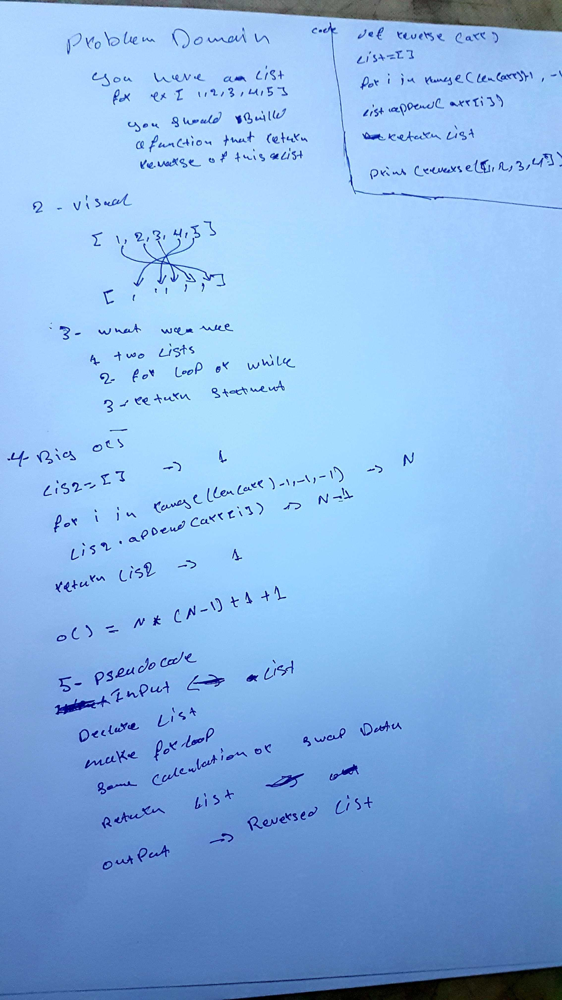

# 401 Python Data Structures and Algorithms

___

# Implementation: Singly Linked Lists
- Create an algorithm that Implement and create a linked list and 
___

## Approach & Efficiency
- I Use __str__ to print all nodes and for the time i think it will be O(N).
- also i use insert_to_the_first function to add node at the begining and the worst case for this function (method) is O(1)

- and add_in_the_end method to append the node in the end and the worst case for this fuction is O(n)

___

