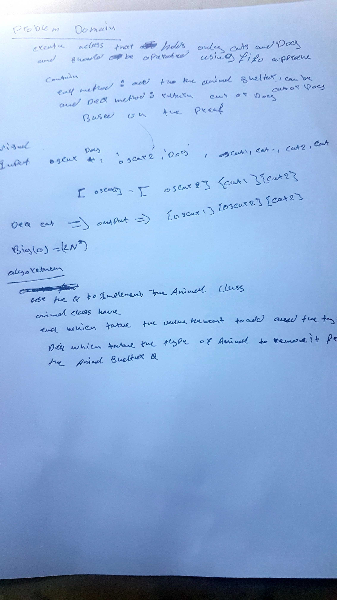

# Animal Shelter

## problem Domian
- Create an animal shelter class that holds dogs and cats in a queue, using FIFO concept. It should have enqueue methods and dequeue methods. Enqueue takes in an animal and dequeue takes in a preference and returns the first node with the value of that preference.

### Implementation:
- implementde using Queue 
___

### Whitebord

